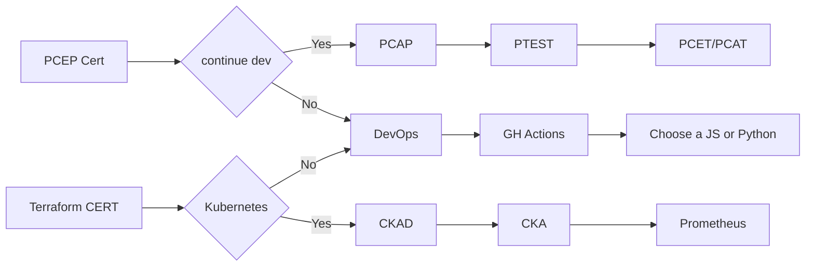
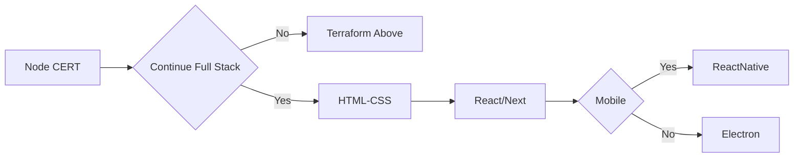

# 

These labs and blogs are published under the [MIT License](./LICENSE) 

## The labs and blogs

This site is an experimental blog enging to publish blogs and labs.  There is **Nothing** production ready and most of it may not work at all. 

## Intent and Purpose

The intent of these labs and blogs are for the author's learning.  They are public in the event that they be of use to you, the reader.  The labs are written for experience engineers looking to modernize their legacy skills; therefore there is an implied depth the author assumes the audience/reader has.

## Greetings

Hello, 

My name is David Benna.  I am a cloud and devops engineer.  I have been working with Amazon AWS Cloud since 2013, Kubernetes since 2019 (K8 1.14) and lately Azure.  I cannot document everything since they, but the goal is to capture items that are helpful to me and in turn may be of use to you.   

## Forming Working Groups

In 2013 I was employed as an Infrastructure Engineer supporting a large application and projects.  The team I support had a mix of MiddleWare, DBA's, UNIX/Linux and Windows Admins, Storage with requirements being driven by the app teams and security.  Like most infrastructure, our economies where driven by expensing secure and compute over multiple projects and customers.  

In 2013 AWS became FedRAMP certified and I was tasked to learn AWS and build a plan to migrate applications to it.

### AWS and Beyond Working Group

Since my group/division was a large group with multiple teams, the shift from On-Prem to the cloud was a big change. I formed a working group which I called **AWS and Beyond**.   Some of these labs go back to those working groups with some upgrades.

## Pathways

There are three pathways that these labs follow:

- Python (DEV) *Adding dev to your skill set*In many shops DevOps means specialized Dev
- Terraform - Infrastructure as Code(IAC)*Transforming automation skills to modern cloud infrastructure*
- Node.js/Mongo (JavaScript)

DevOps and DevSecOps are sprinkled through all the projects.

Go is a good alternative language, however we feel it is better to learn a scripting language first before moving on.

### ABOUT THE PATHWAYS

The paths are rough guidance and not exact paths.  I feel they express a good starting place and more details are given in the labs and blogs.

## Python Terraform Infrastructure Path

[Python Labs](./labs/python/)

Terraform and Python are often used for infrastructure and security automation. We recommend starting with either python or terraform. Complete the path then move to next.

## JavaScript Path

[JavaScript Labs](./labs/)

Notes
- We start with node.js because our students have backend experience and this is the best place to leverage their existing skills
- **The node.js certs save cancelled/deprecated.**  
*Updates soon*
- Some students may want to continue the JS path and add full stack dev
- Frontend openjs certs are available, however they are currently being reviewed.  Expect updated to below chart

bile

### Python 
The python path focuses on learning Python for development.  The full path follows the [Python Institutes Certification Tracts](https://pythoninstitute.org/certification-tracks).  The path is broken down into three Phases:

#### Python - Phase One

#### Python - Phase Two

#### Python - Phase Three

### Terraform 

### DevOps/Agile 
