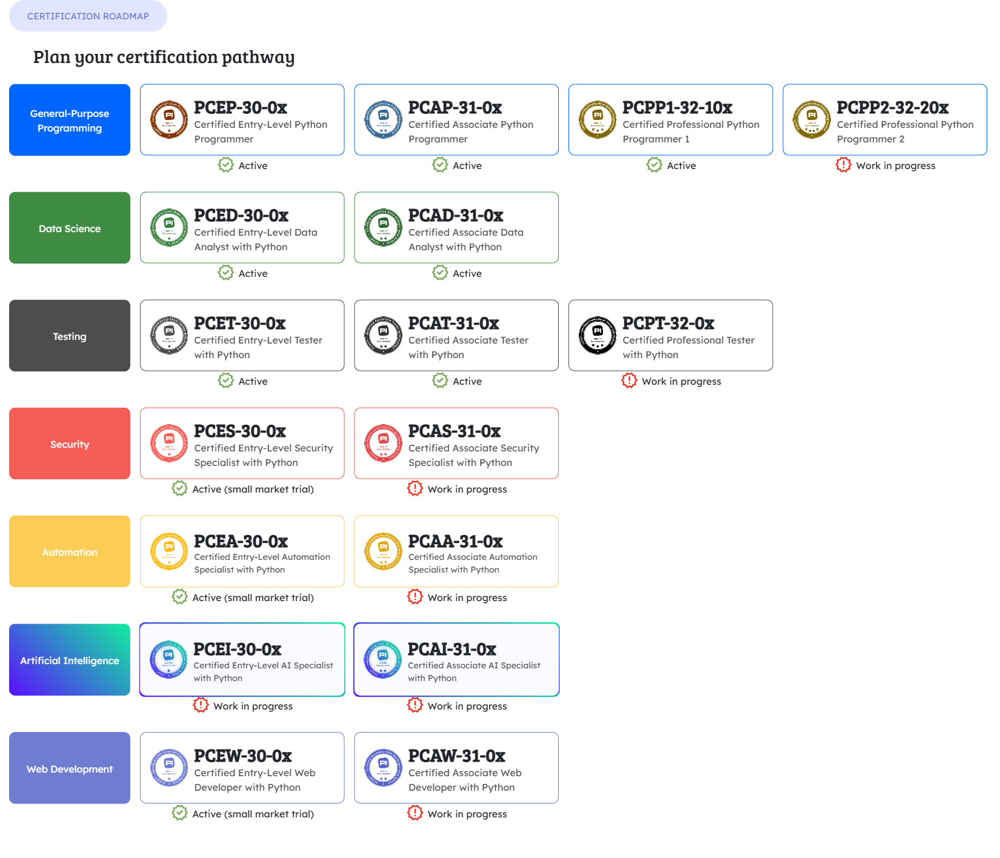

# README.md

Welcome to python labs. The pre-reqs for python labs are Certified Entry-Level Python Programmer (PCEP) skills. See the Python Institutes PCEP site for details:

The python labs loosely follow the Python Institutes certification road map.  The road map is very extensive and we only implemented part of it.  For that matter the institute is still completing areas of the road map.  

All the labs are run from the [python-labs folder](https://github.com/cranoak/cranoaklabs-public/blob/r1/python-labs/REAMDE.md) in github.  

## Pre-Reqs

You need basic Python skills in order to be comfortable with the python labs. 

- [Python.org Tutorial](https://docs.python.org/3/tutorial/index.html) was created by the creators and maintainers of python. The tutorial provides PCEP level skills and in some cases goes deeper.    

- [Certified Entry-Level Python Programmer](https://pythoninstitute.org/pcep) certification provides basic skills needed to start the labs. They offer a free course covering basic skills. 

- Online video training.  Currently we recommend all you can eat [Udemy](https://udemy.com) since they have courses that cover all CranOak lab areas 

## Python Labs

We progressively build on specific python certification areas.  **We do not** complete all of them as some fall out of my core competency areas.   Where Cranoak covers these areas we use one on one consultation specific to a consultants needs.

- [PCEP python basics] these are complementary 
- MKDOCS which is a python based static site generator
- 

## Lab Progression

We follow a simple R1, R2 ... release cycle.  Below is our partial roadmap

### R1
- PCEP cert support
- Cloud labs leveraging PCEP skills

### R2 
- FastAPI leverage PCAP skills
- GitHub actions combined with PCET cert support  *in progress*  
  This will be 

## Python Certification Roadmap and Deeper Learning sites

- The site contains a simplified road map.  A more complete road map is below:
  [Python Institute Certification Roadmap](https://www.python.org/doc/)

- For you convenience we posted it here.  Keep in mind the roadmap will be update and this map may be stale.  See python institute for up to date information.
  

