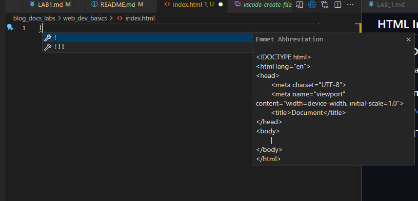
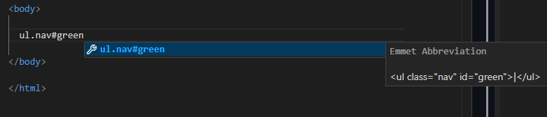
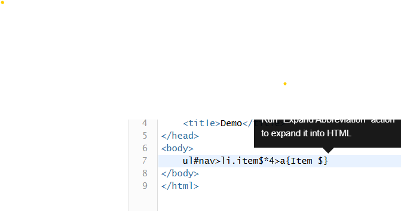
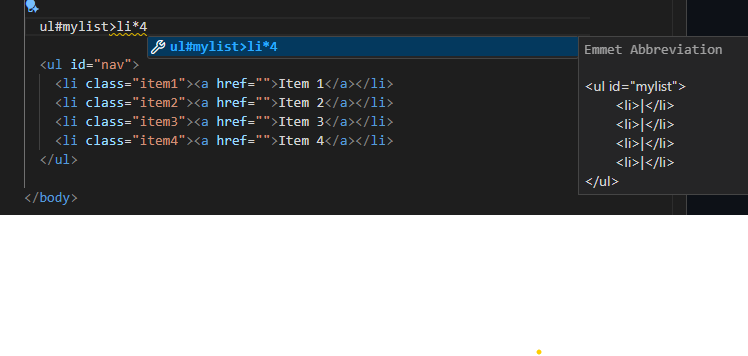

# web_dev_INDEX.md

All of our students have done some type of basic web development, however none of them have been full time web/ui developers. 

## GOAL

The goal of this first lab is to teach web tech basics around the following:

- HTML
- CSS
- JavaScript

We do not expect students to have all these areas memorized but should be comfortable understanding how the integrate.  

**IMPORTANT NOTE:**  
The topics are repeated with each progression. Students should not overly focus on become expert in HTML, CSS and JS in this step.  We will continue to cover these arees as we progress with later labs.  

We will only use [Mozilla Developement Network (MDN)](https://developer.mozilla.org/en-US/)

## Steps

- [VSCode Setup](#vscode-setup)
- [HTML Intro With MDN ](#html-intro)
- [CSS Intro with MDN](#css-intro) 
- [ JavaScript Into with MDN](#js-intro)

## VSCode setup

- [Vim Enhanced](https://marketplace.visualstudio.com/items?itemName=mcaragheorghe.vim-enhanced)
- [GitHub Markdown Preview](https://marketplace.visualstudio.com/items?itemName=bierner.markdown-preview-github-styles)
- [Live Server(Five Server)](https://marketplace.visualstudio.com/items?itemName=yandeu.five-server)  
- [Tailwind CSS Intellisense](https://marketplace.visualstudio.com/items?itemName=bradlc.vscode-tailwindcss)
- [Prettier Code formatter](https://marketplace.visualstudio.com/items?itemName=esbenp.prettier-vscode)
- [EsLint](https://marketplace.visualstudio.com/items?itemName=dbaeumer.vscode-eslint)
- [Prettier - Code Formatter](https://marketplace.visualstudio.com/items?itemName=esbenp.prettier-vscode)  
  There are forks of prettier that may be better. 
  [Prettier-Standard - JS Formatter](https://marketplace.visualstudio.com/items?itemName=numso.prettier-standard-vscode)  

## HTML Intro

### Read  MDN [Your First Web Site](https://developer.mozilla.org/en-US/docs/Learn_web_development/Getting_started/Your_first_website/Creating_the_content)  
  We will create a similer site from scratch using [Emmet HTML Generator](https://docs.emmet.io/)

### Watch Emmet Video  
[Emmet HTML Generator](https://docs.emmet.io/)

### Create HTML page using Emmet

- Create blank index.html  

- Add base html template  

- Create Simple List w Emmet

- Create List like web example from video [Emmet HTML Generator](https://docs.emmet.io/)

Notice use of $ as variable.  More on this later.  

- Create unorderd list with 4 li elements

Please [Mozilla Developement Network (MDN)](https://developer.mozilla.org/en-US/docs/Web/HTML)

## CSS Intro

## JS Intro