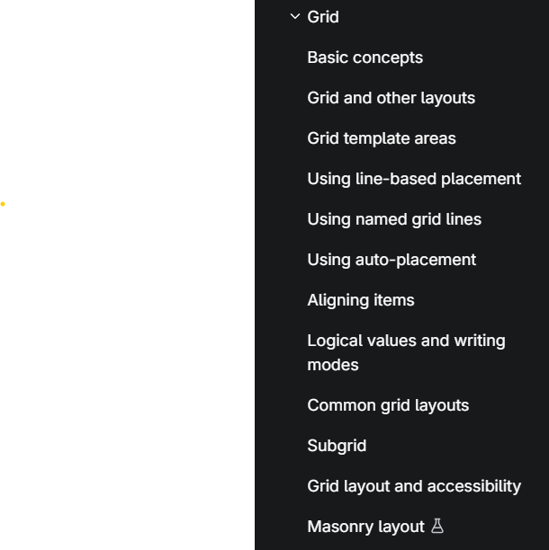

# Grid CSS/README.md

## Grid

- [Grid Layout](https://developer.mozilla.org/en-US/docs/Web/CSS/Guides/Grid_layout)

Build excersize from [MDN - Grid Layout](https://developer.mozilla.org/en-US/docs/Web/CSS/Guides/Flexible_box_layout/Use_cases)

