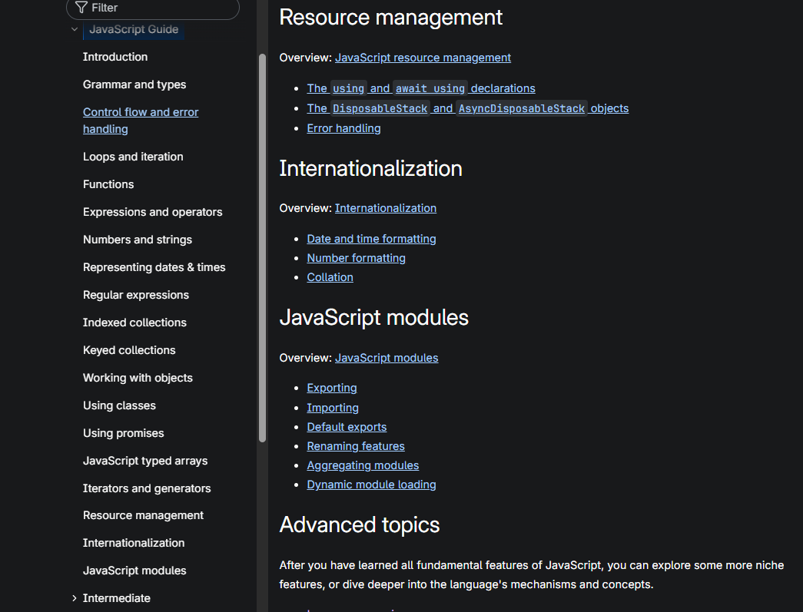

# JS DOM/README.md

## Assignment

- Read through the [MDN JS Docs](https://developer.mozilla.org/en-US/docs/Web/JavaScript)
- Create sub-tasks using the [JavaScript Guide](https://developer.mozilla.org/en-US/docs/Web/JavaScript/Guide)

##

JavaScript documentation of core language features (pure [ECMAScript](https://developer.mozilla.org/en-US/docs/Web/JavaScript/Reference/JavaScript_technologies_overview), for the most part) includes the following:

- The [JavaScript guide](https://developer.mozilla.org/en-US/docs/Web/JavaScript/Guide)
- The [JavaScript reference](https://developer.mozilla.org/en-US/docs/Web/JavaScript/Reference)
- [MDN JS Docs](https://developer.mozilla.org/en-US/docs/Web/JavaScript)
  - See notable non browser uses.

## JS Options R1

See links in [MDN JS Docs](https://developer.mozilla.org/en-US/docs/Web/JavaScript) for more details

### JS Dynamic Capabilties

- Object Construction
- Variable parameter lists
- Function Variables
- Dynamic Script Creation (eval)
- Object introspection
  - for...in
  - Object ulitlies(https://developer.mozilla.org/en-US/docs/Web/JavaScript/Reference/Global_Objects/Object#static_methods)

### API's

- Web API's
- DOM
